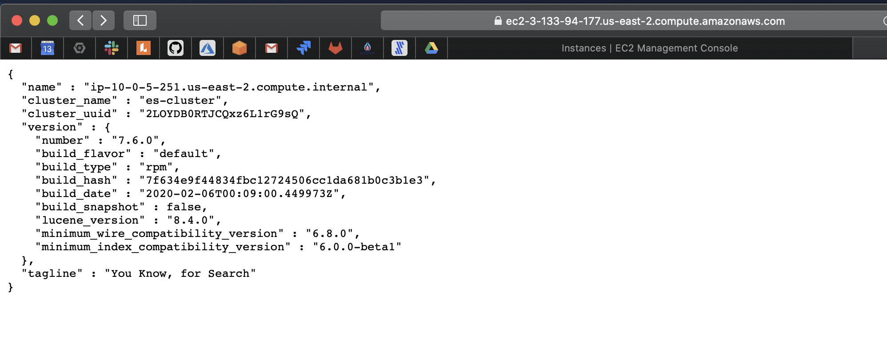

## es on ec2

This repository contains code and instructions to create EC2 instance or instances and then set up password enabled ElasticSearch cluster on it with secure communication

---

### Setting up the terraform provider

Copy the `provider.tf.template` to create a new `provider.tf`

```
provider "aws" {
  version = "~> 2.0"
  region  = var.location
  access_key = ""
  secret_key = ""
}
```

Add your `access_key` and `secret key`. `provider.tf` is added in `.gitignore` so it won't be checked in and stay on your local system.

### Tools

IaC -> Terraform

Bootstraping -> EC2 user data (bash sent as user-data)

Node Discovery -> nmap

SSL -> self signed certificate

### Description

In this solution Terraform is used for IaC. It creates a VPC, a public subnet, an internet gateway, route table, route table association, security groups, and instances. 

The instances are created in the VPC and the public subnet that we create using this template. 

Since the subnet is public(should be private ideally), to restrict access you can add a list of IPs to whitelist in `variables.tfvars`

`variables.tf` contains variable descriptions and declarations along with Default: and permissible values.
You can assign values to those in `variables.tfvars`

### Getting Started

* Clone the repository

* Create an ssh-key pair for AWS EC2 if you don't have one

* Create PCKS#12(.p12) key for SSL signing. You can do this by running `docker run -it -v $(pwd)/creds:/certs --entrypoint "bin/elasticsearch-certutil" docker.elastic.co/elasticsearch/elasticsearch:7.6.0 ca --pass '' --out /certs/ca.p12`. 
  * `./creds` is added in `.gitignore`, so your key stays locally

  * You can create your own (.p12)CA using `openssl` too

  * If you are using some other(.p12) certificate, plese move it to ./creds/ or set the path as variable

* Setup the credentials in `provider.tf`

* Override variable in `variables.tfvars` if needed

* Create `secrets.tfvars` from `secrets.tfvars.template`. Replace `Changeme` with the new password you want to set for ElasticSearch. `secrets.tfvars` is added in `.gitignore`

* Run `terraform apply -var-file variables.tfvars -var-file secrets.tfvars`

* Your resources should be getting created now. Wait.

* After the instances are in healthy state, you can visit `https://<your-instance-public-dns>:9200`. You will need to add the certs to your browser since they are self signed. Login using `elastic` user and the password you set in `secrets.tfvars`.



* You can also test using curl `curl -k -u elastic:<passowrd> --cert-type P12 --cert creds/ca.p12: https://<your-instance-public-dns>:9200/_cat/nodes\?v\&pretty`

```
 ~/De/es-on-ec2/multi-node >> curl -u elastic:Changeme --cert-type P12 --cert creds/ca.p12: -k https://ec2-3-133-94-177.us-east-2.compute.amazonaws.com:9200/_cat/nodes\?v\&pretty
ip         heap.percent ram.percent cpu load_1m load_5m load_15m node.role master name
10.0.5.251           21          55   0    0.00    0.43     0.45 dilm      -      ip-10-0-5-251.us-east-2.compute.internal
10.0.5.87            38          55   0    0.07    0.41     0.44 dilm      *      ip-10-0-5-87.us-east-2.compute.internal
10.0.5.153           38          54   0    0.00    0.35     0.33 dilm      -      ip-10-0-5-153.us-east-2.compute.internal
```

## Supported Variables

| Variable | Description | Default/Acceptable values |
| ------------- | ------------- | ------------- | 
| `location` | AWS region to create resources in | AWS regions Default: `us-east-2` |
| `vpc_cidr` | The CIDR block for the VPC. Default: value is a valid CIDR, but not acceptable by AWS and should be overridden | valid CIDR range Default:`0.0.0.0/0` Must Change |
| `vpc_tags` | Tags for the VPC | Tags in map format |
| `public_subnet_cidr` | The CIDR block for the Subnet. Default: value is a valid CIDR, but not acceptable by AWS and should be overridden | valid CIDR range within VPC Default:`0.0.0.0/0` Must Change | 
| `enable_dns_hostnames` | Should attach dns hostname to instances | Boolean Default: `true` |
| `map_public_ip_on_launch` | Should attach public ip to instances | Boolean Default: `true` |
| `associate_public_ip_address_instance` | Should attach public ip to instances | Boolean Default: `true` |
| `es_tags` | Additional tags for the instances | Tags in map format |
| `node_count` | number of nodes | Number Default: `2` |
| `key_name` | Key to be used | SSH key-pair name |
| `es_data_disk_size` | ebs disk size of nodes | Default: `10` |
| `delete_volume` | delete ebs volume | Boolean Default: `true` |
| `monitoring` | enable monitoring | Boolean Default: `false` |
| `es_az` | es_az | AZ for subnet and instance Default: `us-east-2b` |
| `instance_type` | instance_type | t2-medium recommended |
| `ip_whitelist` | IPs to whitelist | Default: `0.0.0.0/0`| 
| `elastic_password` | Bootstrap Password for elastic user | Change in `secrets.vars` |
| `cert_file_path` | Path to the certficate | Change in `secrets.vars` Default: `creds/ca.p12`|
| `cert_file_passwd` | Password for the certficate | Change in `secrets.vars` Default: `""`|

Some answers we are looking:
1. What did you choose to automate the provisioning and bootstrapping of the instance? Why?

Terraform and bash. Terraform has cross-compatibility for multiple cloud and the use case did could be achieved using just these two. bash is used within terraform, so essentially, only one tool.

2. How did you choose to secure ElasticSearch? Why?

Used ElasticSearch Xpack security bundle to set password for elastic user during bootstrap

Used self signed certs by ES for SSL encryption

3. How would you monitor this instance? What metrics would you monitor?

Cloudwatch/Prometheus. (HTTP requests, bytes written, healthcheck, disk availability)

4. Could you extend your solution to launch a secure cluster of ElasticSearch nodes? What
would need to change to support this use case?

Yes. It already does. Increase the number of instances and it will automatically try to connect on all ip's on subnet network.

5. Could you extend your solution to replace a running ElasticSearch instance with little or no
downtime? How?

Yes, some modifications will be required. I can preserve the volume before instance deletion and mount on new node.

6. Was it a priority to make your code well structured, extensible, and reusable?

Yes

7. What sacrifices did you make due to time?

  * Create a Custom AMI, setup on private subnet and run a web server in public subnet to expose publically, Use ACM

  * Support multiple SSL signing mechanisms and ACM

  * Create instances using ASG and launch configuration

  * More Customization Options

  * Could have used Let's encrypt/ trusted CA certicate instead of self signed certificate
  
  * Automated pipeline
  
  * Better documentation

References: https://www.docker.elastic.co
